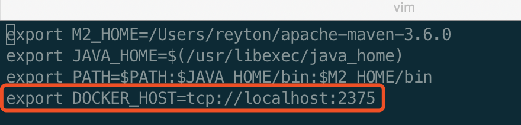
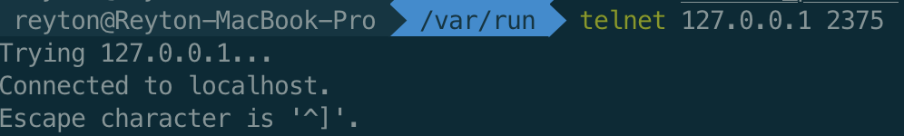
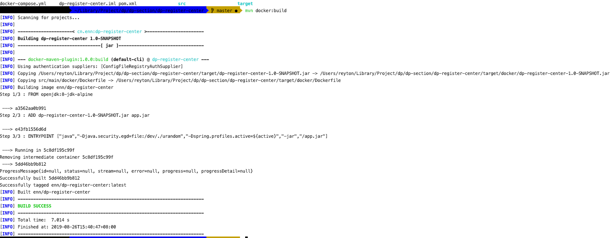

## Docker for Mac 2375端口无法访问解决方案

参考GitHub issues：

https://github.com/docker/for-mac/issues/770

执行：

```bash
docker run -d -v /var/run/docker.sock:/var/run/docker.sock -p 127.0.0.1:2375:2375 bobrik/socat TCP-LISTEN:2375,fork UNIX-CONNECT:/var/run/docker.sock
```

添加环境变量：

```bash
vim ~/.bash_profile
```



```bash
export DOCKER_HOST=tcp://localhost:2375
```

让环境变量生效：

```bash
source ~/.bash_profile
```

重新Telnet测试：

```
telnet localhsot 2375
```

 

到项目目录使用Maven Docker Plugin进行Build

```bash
mvn docker:build
```



成功。

