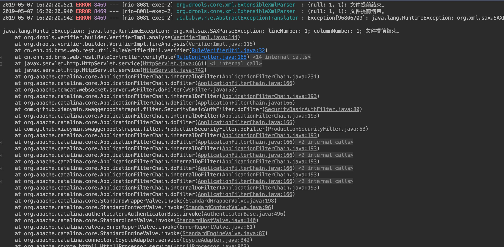
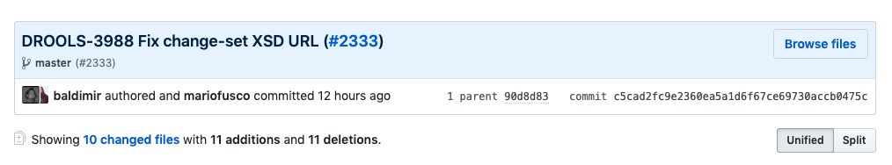
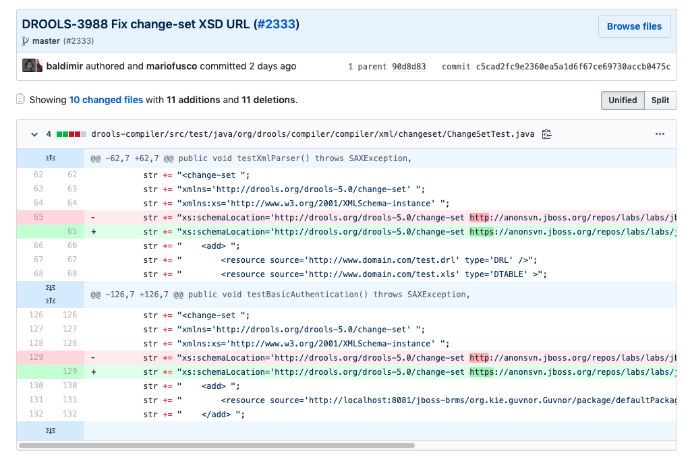

Drools Verifier发生XML解析错误的问题，Drools统一版本为**7.19.0.Final**，堆栈跟踪如下：

错误发生在Drools-Verifier-DRL 内部，所解析的XML文件为：scope-knowledge-package.xml，后续下载源码后，跟踪Debug无解。

之后去检查Drools-Verifier-DRL的Drools官方代码库（Drools项目中），发现对应文件有一项Commit：

Commit Message很明确，修复了XSD URL，检查文件内容：

真相大白：

原来知只是更新了http为htpps，解析时通过http解析不通过。

后续解决方案，来自stackoverflow：

1.设置系统参数：System.setProperty("drools.schema.validating","false");

2.使用JBoss Public Mavne 仓库更新Drools版本为7.22.0-SHAPSHOT；

3.手动修改Jar包中的文件（未测试可行性）；

总结：

Drools 中目前存在引用外部网络资源的情况，例如上述的XSD文件，目前据了解Drools还没有像Spring那样提供本地化资源的解决方案（Spring 的做法是将XSD文件本地化，XML配置文件再引入），所以仍然对于内网应用环境来说是一个隐患，它有可能因为这样一个错误导致服务不可用，目前情况还是等待Drools后续版本的发布。

