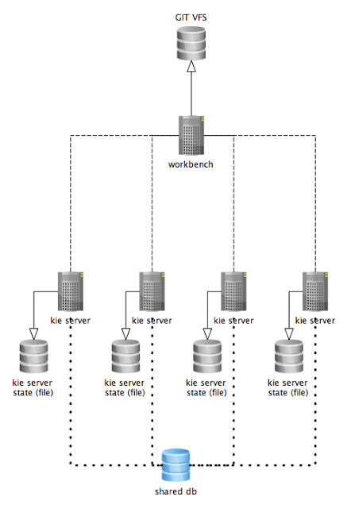

## Drools系统架构

示例一：

1.单个Drools控制器（Business Central）管理多个KIE Excution Server，常规架构

2.使用Zookeeper同步的分布式Drools控制器（Business Central）架构

示例二：

1.基于KIE Workbench维护规则工程

2.自建后台集成 KIE Workbench

3.自建后台网站集成KIE Excution Server 的 REST API

 