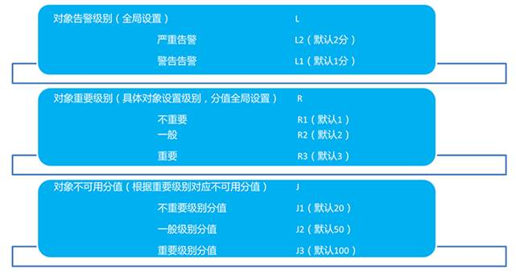
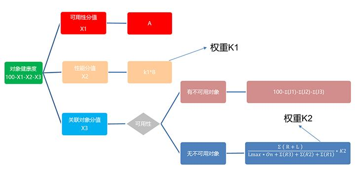
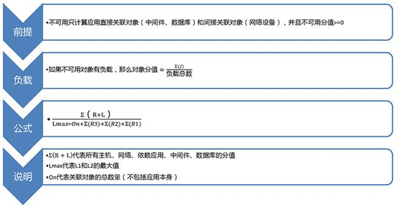

# IT集中监控之业务系统健康度

IT集中监控之业务系统健康度随着网络技术的发展，公司越来越多的业务出现在互联网，给用户带来诸多便捷。但是随着用户量的增加、数据量的增大，业务系统的压力也越来越大，对运行的IT基础资源要求也越来越高。业务系统出现故障，将导致许多基本业务无法开展。为了避免业务系统不可用导致关键业务的运营受到影响，如果IT管理员能通过软、硬件设备，对可能影响业务系统可用性的因素进行持续监控，并在故障发生的第一时间通知相关人员，判断故障的根源，就可以在最短时间内解决故障，减少业务系统停机时间，提升业务系统可用性，最终提高用户的满意度。

**一、业务系统健康度**

传统的监控工具主要是针对资源层次的监控，关注各种资源的运行状况，但没有对业务系统的运行状况进行整体上的评估。

IT集中监控的业务系统健康度是通过CFIA理论树形逻辑关联算法，以应用系统为核心，计算关联的网络、主机、数据库、中间件的故障影响范围，得出是否导致应用系统故障，从而帮助管理者针对应用系统故障快速定位和解决。

**二、业务系统健康度因子**

1、关键点

首先将网络、中间件、数据库作为配置元素进行统一管理，根据实际需要，建立各CI之间的关系模型。

然后抽象出关键业务点的关键性能指标，并建立之间的关系，并设置关键点的重要等级权值。

2、可用性

首先将业务系统的运行状态分为可用和不可用两个状态，健康度是建立在业务系统可用的基础上，若业务系统不可用，那么健康度无效。

然后将业务系统关联的关键点网络、中间件、数据库的运维状态分为可用和不可用两个状态，如果有不可用，那么根据关键点重要等级权重计算业务系统健康度。

3、性能

业务系统的性能指标主要包含响应时间和加载速度，并且可以通过控制性能健康度权重值调节业务系统健康度。

**三、业务系统健康度模型**

1、健康度模型参数

2、健康度模型逻辑

3、健康度模型公式

**四、总结**

IT集中监控的业务系统健康度，可以让运维监控人员从海量的告警分析、告警实时监测工作中解脱出来，而且还能够实时、快速、动态地掌握业务系统运行健康状况，从而极大地提高运维人员工作效率，并且能够有效地保障业务系统健康稳定运行，真正做到“事前监控预防，事后根源定位”。