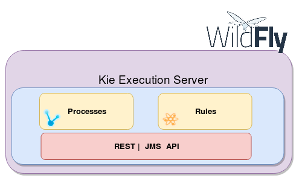

Kie Execution Server 可以用来运行已经打包好的Kjar，供外部系统进行调用，通常Kjar中的内容分为**工作流**和**规则**两个部分。

**Kie Execution Server** 的架构图：

**Kie Server**：提供规则和流程的**运行时**环境，一个**Kie Server实例**可以支持多个**Kie Container**；

**Kie Server Extension**：Kie Server 的插件，用于拓展Kie Server的功能；Kie Server 默认带了两个插件：BRM（业务规则管理）和BPM（业务流程管理）；

**Kie Container**：kjar的实例，它们可以是域模型、流程或者规则，通过Kie Server 提供的REST和JMS的标准API公开Kie Container；

**Controller**：一个由服务器支持的REST模块，负责管理KIE Server 实例，它提供以下功能：

- 相应连接请求；
- 根据Kie Server的ID在相应的Kie Server上同步所有已经注册的容器；
- 响应断开请求；

**Kie Server state**：目前已知的给定Kie Server实例的状态，这是一个本地存储(默认情况下在文件中)，它维护以下信息：

- 已注册的Controller列表；

- 已知的 Kie Container 的列表；

- Kie Server 的配置；

  Kie Server state在接收到事件时被持久化，比如:创建了Kie Container，处理了Kie Container，Controller接受了Kie Server实例的注册，等等。

**Kie Server ID**：每个Kie Server 实例拥有一个ID，ID与Controller上的配置相匹配；