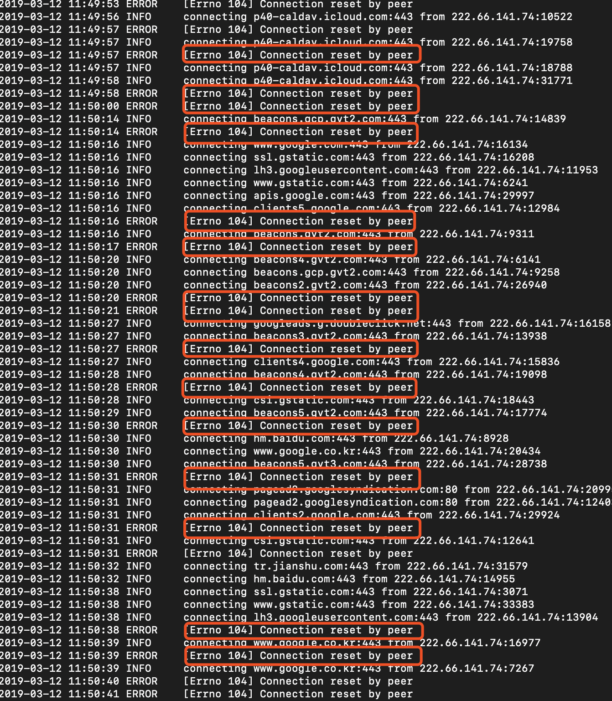

## Shadowsocks转入V2Ray的怀抱

最近由于两会的原因，GFW对于网络的审查越发严格，给我的切实体会就是最近时不时断网。

例如这样，TCP阻截大法：

怀疑就是GFW最近在通过随机阻截TCP流量，然后对流量进行采样内容审查，这样做也可能是因为GFW也不可能对于所有流量都进行审查，如果这样做的话是极度消耗资源的，不过对于我来说，我访问的流量也只不过是为了获取一些学术资料而已。

但是GFW这样子审查下去实在不是个办法，对于我个人使用而言网络流畅度和稳定性需求大于一切，但现在GFW的审查弄得我查阅资料的过程很不舒服，所以我翻阅资料寻求解决方案最后找到了一个学习成本相对较低的解决方案——在我的服务器上再部署一个V2Ray应用

