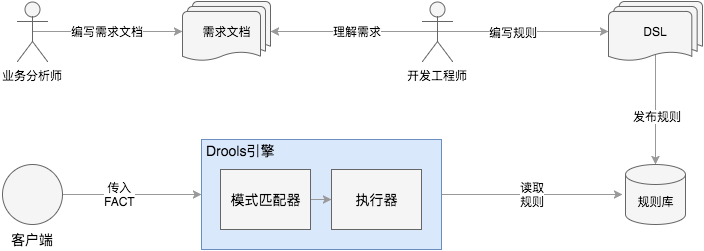

# 从0到1：构建强大且易用的规则引擎

> 原文发布于微信公众号 - 美团点评技术团队（meituantech）
>
> 原文发表时间：2017-06-09

引言

2016年07月恰逢美团点评的业务进入“下半场”，需要我们在各个环节优化体验、提升效率、降低成本。技术团队需要怎么做来适应这个变化？这个问题直接影响着之后的工作思路。

美团外卖的CRM业务步入成熟期，规则类需求几乎撑起了这个业务所有需求的半边天。一方面规则唯一不变的是“多变”，另一方面开发团队对“规则开发”的感受是乏味、疲惫和缺乏技术含量。如何解决规则开发的效率问题，最大化解放开发团队成为目前的一个KPI。

规则引擎作为常见的维护策略规则的框架很快进入我的思路。它能将业务决策逻辑从系统逻辑中抽离出来，使两种逻辑可以独立于彼此而变化，这样可以明显降低两种逻辑的维护成本。

分析规则引擎如何设计正是本文的主题，过程中也简单介绍了实现方案。 

案例

首先回顾几个美团点评的业务场景。通过这些场景大家能更好地理解什么是规则，规则的边界是什么。在每个场景后面都介绍了业务系统现在使用的解决方案以及主要的优缺点。


### **门店信息校验**

###  

### **场景**

美团点评合并前的美团平台事业部中，门店信息入口作为门店信息的第一道关卡，有一个很重要的职责，就是质量控制，其中第一步就是针对一些字段的校验规则。

下面从流程的角度看下门店信息入口业务里校验门店信息的规则模型（已简化），如下图。


规则主体包括3部分：

- 分支条件。分支内逻辑条件为“==”和“<”。
- 简单计算规则。如：字符串长度。
- 业务定制计算规则。如：逆地址解析、经纬度反算等。

### 

### **方案——硬编码**

由于历史原因，门店信息校验采用了硬编码的方式，伪代码如下：

```javascript
if (StringUtil.isBlank(fieldA)
    || StringUtil.isBlank(fieldB)
    || StringUtil.isBlank(fieldC)
    || StringUtil.isBlank(fieldD)) {
    return ResultDOFactory.createResultDO(Code.PARAM_ERROR, "门店参数缺少必填项");
}
if (fieldA.length() < 10) {
    return ResultDOFactory.createResultDO(Code.PARAM_ERROR, "门店名称长度不能少于10个字符");
}
if (!isConsistent(fieldB, fieldC, fieldD)) {
    return ResultDOFactory.createResultDO(Code.PARAM_ERROR, "门店xxx地址、行政区和经纬度不一致");
}
```

优点

- 当规则较少、变动不频繁时，开发效率最高。
- 稳定性较佳：语法级别错误不会出现，由编译系统保证。

缺点

- 规则迭代成本高：对规则的少量改动就需要走全流程（开发、测试、部署）。
- 当存量规则较多时，可维护性差。
- 规则开发和维护门槛高：规则对业务分析人员不可见。业务分析人员有规则变更需求后无法自助完成开发，需要由开发人员介入开发。 

### **门店审核流程** 

### **场景**

流程控制中心（负责在运行时根据输入参数选择不同的流程节点从而构建一个流程实例）会根据输入门店信息中的渠道来源和品牌等特征确定本次审核（不）走哪些节点，其中选择策略的模型如下图。


规则主体是分支条件：

- 分支条件主体是“==”，参与计算的参数是固定值和用户输入实体的属性（比如：渠道来源和品牌类型）。

###  

### **方案——开源Drools从入门到放弃**

经过一系列调研团队选择基于开源规则引擎Drools来配置流程中审核节点的选择策略。使用Drools后的规则配置流程如下图。



上图中DSL即是规则主体，规则内容如下：

```javascript
rule "1.1"
    when
        poi : POI( source == 1 && brandType == 1 )
    then
            System.out.println( "1.1 matched" );
            poi.setPassedNodes(1);

end

rule "1.2"
    when
        poi : POI( source == 1 && brandType == 2 )
    then
            System.out.println( "1.2 matched" );

end

rule "2.1"
    when
        poi : POI( source == 2 && brandType == 1 )
    then
            System.out.println( "2.1 matched" );
            poi.setPassedNodes(2);

end

rule "2.2"
    when
        poi : POI( source == 2 && brandType == 2 )
    then
            System.out.println( "2.2 matched" );
            poi.setPassedNodes(3);

end
```

在实践中，我们发现Drools方案有以下几个优缺点：

优点

- 策略规则和执行逻辑解耦方便维护。

缺点

- 业务分析师无法独立完成规则配置：由于规则主体DSL是编程语言（支持Java, Groovy, Python），因此仍然需要开发工程师维护。
- 规则规模变大以后也会变得不好维护，相对硬编码的优势便不复存在。
- 规则的语法仅适合扁平的规则，对于嵌套条件语义（then里嵌套when...then子句）的规则只能将条件进行笛卡尔积组合以后进行配置，不利于维护。

由于Drools的问题较多，最后这个方案还是放弃了。

##  

### **绩效指标计算**

### **场景**

美团外卖业务发展非常迅速，绩效指标规则需要快速迭代才能紧跟业务发展步伐。绩效考核频率是一个月一次，因此绩效规则的迭代频率也是每月一次。因为绩效规则系统是硬编码实现，因此开发团队需要投入大量的人力满足规则更新需求。

2016年10月底我受绩效团队委托成立一个项目组，开发部署了一套绩效指标配置系统，系统上线直接减少了产品经理和技术团队70%的工作量。

下面我们首先分析下绩效指标计算的规则模型，如下图。


规则主体是结构化数据处理逻辑：

- 规则逻辑是从若干数据源获取数据，然后进行一系列聚合处理（可以采用结构化查询SQL语句+少量代码实现），最后输出到目标数据源。

### 

### **方案——业务定制规则引擎**

绩效规则主体是数据处理，但我们认为数据处理同样属于规则的范畴，因此我们将其放在本文进行分析。

下图是绩效指标配置系统。触发器负责定时驱动引擎进行计算；视图负责给商业分析师提供规则配置界面，规则表达能力取决于视图；引擎负责将配置的规则解析成Spark原语进行计算。


优点

- 规则配置门槛低：视图和引擎内部数据模型完全贴合绩效业务模型，因此业务分析师很容易上手。
- 系统支持规则热部署。

缺点

- 适用范围有限：因为视图和引擎的设计完全基于绩效业务模型，因此很难低成本修改后推广到别的业务。

#  

探索全新设计

“案例”一节中三种落地方案的问题总结如下：

- 硬编码迭代成本高。
- Drools维护门槛高。视图对非技术人员不友好，即使对于技术人员来说维护成本也不比硬编码低。
- 绩效定制引擎表达能力有限且扩展性差，无法推广到别的业务。

由于“高效配置规则”是业务里长期存在的刚需，且行业内又缺乏符合需求的解决方案，2017年02月我在团队内部设立了一个虚拟小组专门负责规则引擎的设计研发。引擎设计指标是要覆盖工作中基础的规则迭代需求（包括但不限于“案例”一节中的多个场景），同时针对“案例”一节中已有解决方案扬长避短。下面分3节来重现这个项目的设计过程。首先“需求模型”一节会基于“案例”一节的场景尝试抽象出规则模型，同时提炼出系统设计大纲。然后“Maze框架”一节会基于需求模型设计一个规则引擎。最后“Maze框架能力模型”一节会介绍Maze框架的特点。

##  

## **需求模型** 

对规则引擎来说，世界皆规则。通过“案例”一节的分析，我们对规则以及规则引擎该如何构建的思路正逐渐变得清晰，下面两节分别定义规则数据模型和规则引擎的系统模型，目标是对“Maze框架”一节中的规则引擎产品进行框架性指导。

### 

### **规则数据模型**

规则本质是一个函数，由n个输入、1个输出和函数计算逻辑3部分组成。

> y = f（x1, x2, …, xn）

具体结合“案例”一节中的场景我们梳理出的规则模型如下图所示。


主要由三部分构成：

- FACT对象：用户输入的事实对象，作为决策因子使用。
- 规则：LHS（Left Hand Side）部分即条件分支逻辑。RHS（Right Hand Side）部分即执行逻辑。LHS和RHS部分是由一个或多个模式构成的。模式是规则内最小单位。模式的输入参数可以是另一个模式或FACT对象（比如逻辑与运算[参数1] && [参数2]中参数1可以是另一个表达式）。模式需要支持以下3种类别：
  - 客户定义方法：FACT对象的实例方法、静态方法。
  - 常规表达式：逻辑运算、算数运算、关系运算、对象属性处理等。
  - 结构化查询。
- 结果对象：规则处理完毕后的结果。需要支持自定义类型或者简单类型（Integer、Long、Float、Double、Short、String、Boolean等）。

###  

### **系统模型**

我们需要设计一个系统能配置、加载、解释执行上节中的数据模型，另外设计时还需要规避“案例”一节3个方案的缺点。最终我们定义了如下图所示的系统模型。


主要由3个模块构成。

- 知识库：负责提供配置视图和模式因子。知识库之所以叫“知识”库一个很重要的特征是知识库可以低成本扩展知识。知识扩展包括视图和模式的添加，视图和模式有一对一映射关系，比如我们在界面上展示一个如：大于小于等于一样的视图，则一定有一个模式$参数1 > $参数2与之对应。
  - 一方面降低操作门槛。
  - 一方面约束用户输入，保证输入合法性。
  - 视图：用于业务分析师等非技术背景的人员配置规则。作用两方面：
  - 模式：构成规则的最小单位，不可拆分，可以直接被规则引擎执行。
- 资源管理器：负责管理规则。
  - 版本管理：支持规则迭代更新、回滚和灰度等功能。
  - 依赖管理：负责将规则解析为模式树。为了最大限度地增强规则的表达能力，每一个模式设计都很“原子”，这样如果想配置一个完整语义的规则，则必须由多个子规则共同构成，因此规则之间会有树形依赖关系。如$参数1 + $参数2 > $参数3这样的规则便是由多个模式“复合”而成，则他的依赖关系如下所示。

```javascript
             最终结果           /** 变量模式 */
                |
                |
              中间结果 > $参数3  /** 关系运算模式 */
                |
                |
         $参数1 + $参数2        /** 算数运算模式 */
```

- 规则引擎：负责执行规则。
  - 调度器：根据规则的依赖关系以及硬件资源驱动模式执行器执行模式，目标是达到最大吞吐或最低延迟。
  - 模式执行器：负责直接执行模式。执行器可以根据业务的表达能力需求选择基于Drools、Aviator等第三方引擎，甚至可以基于ANTLR定制。

##  

### **Maze框架**

基于"需求模型"一节的定义，我们开发了Maze框架（Maze是迷宫的意思，寓意：迷宫一样复杂的规则）。

Maze框架分两个引擎：MazeGO（策略引擎）和MazeQL（结构化数据处理引擎）。其中MazeGO内解析到结构化数据处理模式会调用SQLC驱动MazeQL完成计算（比如：从数据库里查询某个BD的月交易额，如果交易额超过30万则执行A逻辑否则执行B逻辑，这个语义的规则即需要执行结构化查询），MazeQL内解析到策略计算模式会调用VectorC驱动MazeGO进行计算（比如：有一张订单表，其中第一列是商品ID，第二列是商品购买数量，第三列是此商品的单价，我们需要计算每类商品的总价则需要对结构化查询到的结果的每一行执行第二列 * 第三列这样的策略模式计算）。


名词解释：

- VectorC指向量计算，针对矩阵的行列进行计算。有三种计算方式：
  1. 针对一行的多列进行策略计算。
  2. 针对一列进行计算。
  3. 针对分组聚合（GroupBy）后的每一组内的列进行运算。
- SQLC指结构化查询。拥有执行SQL的能力。

### 

### **MazeGO**

MazeGO核心主要由3部分构成：资源管理器、知识库和MazeGO引擎。另外两个辅助模块是流量控制器和规则效果分析模块。基本构成如下图。


3个核心模块（引擎、知识库和资源管理器）的职责见“需求模型”一节中“系统模型”一节。下面只介绍下和“系统模型”不同的部分。

1. MazeGO引擎：
   - 预加载规则实例。首先为了避免访问规则时需要实时执行远程调用而造成较大的时延，另外规则并不是时刻发生变更没有必要每次访问时拉取一次最新版本，基于以上两个原因规则管理模块会在引擎初始化阶段将有效版本的规则实例缓存在本地并且监听规则变更事件（监听可以基于ZooKeeper实现）。
   - 预编译规则实例。因为规则每次编译执行会导致性能问题，因此会在引擎初始化和规则有变更这两个时机将增量版本的规则预编译成可执行代码。
   - 规则管理模块。职责如下：
2. 流量控制器：负责不同版本规则的调度。方便业务方修改规则后，灰度部分流量到新规则。
3. 规则效果分析：规则新增或修改后，业务方需要分析效果。本模块会提供：规则内部执行路径、运行时参数和结果的镜像数据，数据可以存储在hbase上。

###  

### **MazeQL**

MazeQL核心主要由3部分构成：配置中心、MazeQL引擎和平台。


1. MazeQL引擎：
   - 调度器。SQLC和VectorC类规则大多由多个规则组合而成（对于SQLC而言可以将依赖的规则简单的理解为子查询），因此也需要和“系统模型”一节一样的调度管理，实现层面完全一致。
   - QL驱动器。驱动平台进行规则计算。因为任务的实际执行平台有多种（会在下一个“平台”部分介绍），因此QL驱动器也有多种实现。
   - 预加载规则实例。首先为了避免访问规则时需要实时执行远程调用而造成较大的时延，另外规则并不是时刻发生变更没有必要每次访问时拉取一次最新版本，基于以上两个原因规则管理模块会在引擎初始化阶段将有效版本的规则实例缓存在本地并且监听规则变更事件（监听可以基于ZooKeeper实现）。
   - 预解析规则实例。因为规则每次解析执行会导致性能（大对象）问题，因此会在引擎初始化阶段解析为运行时可用的调度栈帧。
   - 规则管理模块。职责如下：
   - 运行时模块。分为调度器和QL驱动器。
2. 平台：负责实际执行规则逻辑。分两种运行模式：一种是以嵌入式方式运行在客户端进程内部，好处是实时性更好，时延更低，适合小批量数据处理；另一种是以远程方式运行在Spark平台，适合离线大规模数据处理。
   - 嵌入式模式下是基于Mysql和Derby等实时性较好的数据库实现的。
   - 在Spark平台上是基于Spark SQL实现的。
   - QL执行器。负责执行结构化查询逻辑。两种不同的运行模式下QL执行器在执行SQL模式时会选择两种不同的QL执行器实现，两种实现分别是：
3. 配置中心：提供规则配置视图。
   - 版本管理。同“系统模型”一节。
   - 数据源绑定。即是定义参与计算的SQL逻辑中使用到的数据源，便于系统进行管理。
   - 结构查询定义。即是定义SQL规则，这是主体规则内容。
   - 向量计算定义。定义VectorC类计算（VectorC见“Maze框架”章节开头的介绍）。

##  

### **Maze框架能力模型**

Maze框架是一个适用于非技术背景人员，支持复杂规则的配置和计算引擎。


###  

### **规则迭代安全性**

规则支持热部署：系统通过版本控制，可以灰度一部分流量，增加上线信心。

###  

### 规则表达能力

框架的表达能力覆盖绝大部分代码表达能力。下面用伪代码的形式展示下Maze框架的规则部分具有的能力。

```javascript
// 输入N个FACT对象
function(Fact[] facts) {   
    // 从FACT对象里提取模式     
    String xx= facts[0].xx;  
    // 从某个数据源获取特征数据，SQLC数据处理能力远超sql语言本身能力，SQLC具有编程+SQL的混合能力
    List<Fact> moreFacts = connection.executeQuery("select * from xxx where xx like '%" + xx + "%');  
    // 对特征数据和FACT对象应用用户自定义计算模式
    UserDefinedClass userDefinedObj = userDefinedFuntion(facts, moreFacts);  
    // 使用系统内置表达式模式处理特征                      
    int compareResult = userDefinedObj.getFieldXX().compare(XX); 
    // 声明用户自定义对象         
    UserDefinedResultClass userDefinedResultObj = new UserDefinedResultClass();  
    // 使用系统内置条件语句模式处理特征                              
    if (compareResult  == 0) {     
        userDefinedResultObj.setCompareResult(Boolean.FALSE);
    } else if (compareResult > 0) {
        userDefinedResultObj.setCompareResult(Boolean.FALSE);
    } else {
        userDefinedResultObj.setCompareResult(Boolean.TRUE);
    }
    // 将结果返回给客户
    return userDefinedResultObj;        
}
```

###  

### **规则执行效率**

执行效率分三方面：

1. 引擎的调度模块会确保吞吐优先，并且调度并发度等系统配置可以根据资源情况调整。
2. 引擎运行过程中没有远程通信开销。
3. 引擎执行代码实现编译或解析后执行，运行效率较高。

###  

### **规则接入成本**

####  

#### **开发人员接入**

1. 首先，开发人员在项目工程里导入一个MazeGO jar包。
2. 然后，开发人员在项目工程里需要调用计算规则的地方引入MazeGO client（如下代码片段）。  // 初始化MazeGO client，建议在本应用程序的初始化阶段执行  MazeGOReactor reactor = new MazeGOReactor();  reactor.setMazeIds(Arrays.asList(<mazeId>));  reactor.init();   // 调用MazeGO client执行规则  reactor.go(<mazeId>, <fact>);   // 销毁MazeGO client，建议在本应用程序的销毁阶段执行  reactor.destroy();

####  

#### **规则配置**

规则配置基本实现由业务分析师、产品经理或运营人员自助完成。


业务分析师在MazeGO上配置规则的视图如下图所示。


总结

本文开头介绍了几个工作中的规则使用场景，顺带引出了多个不同的解决方案，最后介绍了Maze框架的设计，基本上展现了我们对这个框架思考和设计的整个过程。