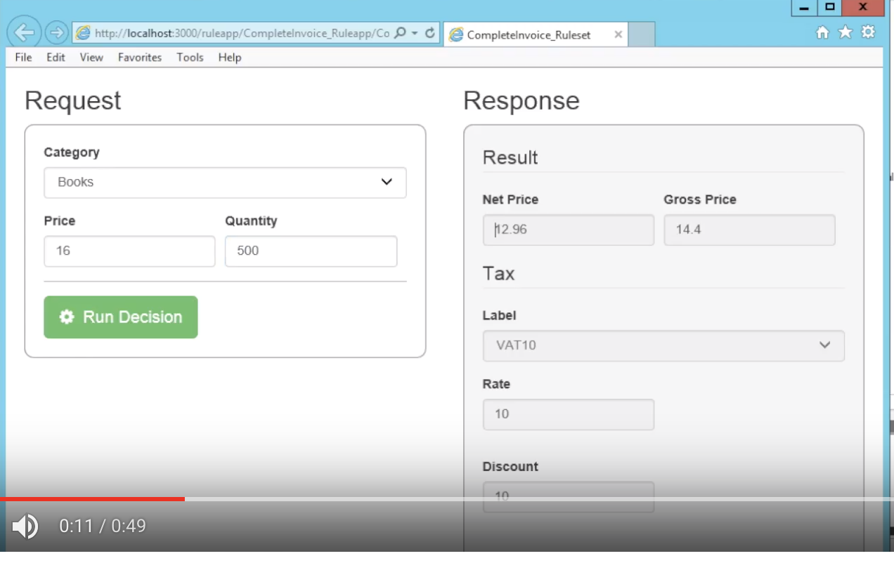

IBM RPA 是一个业务流程机器人自动化，是通过[AA](https://www.ibm.com/case-studies/american-airlines)（被IBM收购）进行业务流程操作编排，使用机器人模拟业务人员操作，达成机器人办公的目的，以用来减少重复劳动力，目前市面上主流的RPA还有UiPath、Blue Prism等；RPA目前还无法完全取代一个完整的劳动力，用“RPA的目的是为了提升工作效率”的说法最为贴切。

IBM ODM 是一个业务规则引擎平台，基于ILOG JRule（被IBM收购），用来给业务人员通过使用用自然语言**如果-那么**来编写业务规则，再通过规则引擎生成业务规则代码**if-else**，其主要作用为抽象为知识库内容，以供逻辑复用，减少硬编码。

IBM RPA 如何与 IBM ODM 进行集成使用？

https://github.com/ODMDev/odm-rpa-invoicing-sample

在这个仓库，IBM ODM团队很好的提供一个解决方案。

官方写了很多内容，也有视频进行了演示：

https://www.youtube.com/watch?v=Z9QIBERy3k8&feature=youtu.be

其实我总结到最后，

他们是

