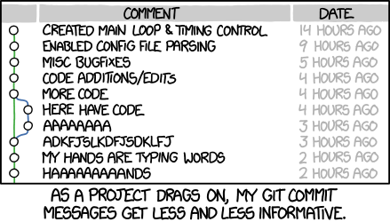
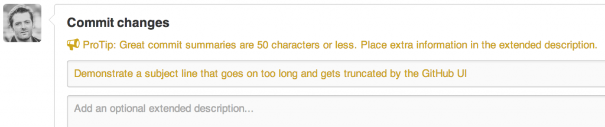

# 如何寫一個 Git Commit Message

原標題：How to Write a Git Commit Message, 31 Aug 2014, By Chris Beams
英文原文：https://chris.beams.io/posts/git-commit/，中文翻譯經作者 Chris Beams 同意。中文翻譯經 Yung-Ching Hsiao 協助潤飾、修正。



------

## 導論：為什麼好的 commit message 很重要

如果你隨機挑一個 git repo 的 log 來閱讀，你大概會發現它的 commit message 是一團糟。舉個例子，看看[這些](https://github.com/spring-projects/spring-framework/commits/e5f4b49?author=cbeams)我以前 committing 到 Spring 的 gems：

```
$ git log --oneline -5 --author cbeams --before "Fri Mar 26 2009"
 
e5f4b49 Re-adding ConfigurationPostProcessorTests after its brief removal in r814. @Ignore-ing the testCglibClassesAreLoadedJustInTimeForEnhancement() method as it turns out this was one of the culprits in the recent build breakage. The classloader hacking causes subtle downstream effects, breaking unrelated tests. The test method is still useful, but should only be run on a manual basis to ensure CGLIB is not prematurely classloaded, and should not be run as part of the automated build.
2db0f12 fixed two build-breaking issues: + reverted ClassMetadataReadingVisitor to revision 794 + eliminated ConfigurationPostProcessorTests until further investigation determines why it causes downstream tests to fail (such as the seemingly unrelated ClassPathXmlApplicationContextTests)
147709f Tweaks to package-info.java files
22b25e0 Consolidated Util and MutableAnnotationUtils classes into existing AsmUtils
7f96f57 polishing
```

Yikes. 跟我最近在同一個 repos 的 commit 相對比一下：

```shell
$ git log --oneline -5 --author pwebb --before "Sat Aug 30 2014"
 
5ba3db6 Fix failing CompositePropertySourceTests
84564a0 Rework @PropertySource early parsing logic
e142fd1 Add tests for ImportSelector meta-data
887815f Update docbook dependency and generate epub
ac8326d Polish mockito usage
```

你覺得哪種看起來比較舒適？

前者無論是在長度或結構上都很糟；後者則是簡明與一致的。前者是大部份情況下會發生的事情，後者從不會偶然發生。

雖然大部分 repos 的 commit message 都跟前者差不多，但還是有例外的情況。可以參考 [Linux kernel](https://github.com/torvalds/linux/commits/master) 以及 [Git 本身](https://github.com/git/git/commits/master)，都是一個很好的範例。再看看 [Spring Boot](https://github.com/spring-projects/spring-boot/commits/master)，或是任何由 [Tim Pope](https://github.com/tpope/vim-pathogen/commits/master) 維護的 repos。

這些 repos 的貢獻者知道一個精心繕打的 Git commit message 是跟其他開發者 (以及未來的自己) 講解一個更動的脈絡的最好方式。一個 `diff` 可以告訴你*什麼*改變了，但是只有 commit message 可以正確的告訴你*為什麼* 。Peter Hutterer [說的很好](http://who-t.blogspot.co.at/2009/12/on-commit-messages.html)：

> 重新了解一段程式碼更動的脈絡很浪費腦力。雖然這件事情沒辦法完全避免，但是我們可以盡量[降低](http://www.osnews.com/story/19266/WTFs_m)這件事情的複雜度。Commit messages 正可以做到這點，而我們可以從 commit message 看出一個開發者是不是一位好的合作對象。

如果你對於什麼樣的內容造就一個好的 Git commit message 沒有太多的想法，這大概是因為你沒有花很多時間使用 `git log` 以及相關的指令。這會產生一個糟糕的循環：因為 commit 歷史是不一致且沒有架構的，你就不會花時間使用它或是維護它。而因為它沒有被使用或是被維護，就會一直是不一致且沒有架構的狀況。

但是一個精心撰寫的 log 是漂亮以及有用的。`git blame`、`revert`、`rebase`、`log`、`shortlog` 以及其他相關的指令會進入到你的生活中。審閱其他人的 commits 以及 pull requests 變成一個值得去做的事情，並且不需要額外的資訊便得完成。理解一件數個月前或者數年前的更動不再是不可能的任務，而是可以迅速、有效率完成的事情。

一個專案是否能長期且成功的運作 (撇除其他影響的因素) 取決於它的可維護性，而在這件事上面沒有其他工具比專案本身的 log 更為強大。所以花時間學習如何撰寫與維護專案的log是件值得投資的事。一開始你可能會覺得麻煩，但它很快的就會變成一種習慣，甚至能成為自豪感以及生產力的來源。

在這篇文章中，我們只針對維護一個可靠的 commit history 中最簡單的一個要件來講解：**如何撰寫一個獨立的 commit message**。其他重要的技巧像是 commit squashing 則不會在這篇文章提到。

多數的程式語言都有其對於命名、格式等慣用風格與慣例。當然，這些慣例會有其他變種，不過多數的開發者會選擇一種風格並且使用它，相比於所有人都使用自己的風格而造成混亂來的好。

團隊之間撰寫 commit log 的方式應該要相同。為了建立一個有用的修訂紀錄，團隊應該要先統一其 commit message 的風格，並且至少定義以下三件事情：

- **風格.** Markup syntax，wrap margins，文法，大寫慣例，符號慣例。定義這些事情，不要用猜的，並且讓它愈簡單愈好。最後的結果會得到一個非常一致的 log，不僅在閱讀時是一種享受，更重要的是人們真的會經常性的去讀它們。
- **內容.** 什麼樣的資訊需要放置在 commit message body 中？什麼*不*需要？
- **Metadata.** issue tracking IDs, pull request 號碼等等的資料該如何被參照？

幸運的是，我們有現成的慣例可以使用，不用重新發明一個。只要遵守下面七條規則，你就能走在成為 commit pro 的路上。


## 偉大 Git commit message 的七條規則

> 記住：[這](http://tbaggery.com/2008/04/19/a-note-about-git-commit-messages.html) [以](http://www.git-scm.com/book/en/Distributed-Git-Contributing-to-a-Project#Commit-Guidelines) [前](https://github.com/torvalds/subsurface/blob/master/README#L82-109) [就](http://who-t.blogspot.co.at/2009/12/on-commit-messages.html) [說](https://github.com/erlang/otp/wiki/writing-good-commit-messages) [了](https://github.com/spring-projects/spring-framework/blob/30bce7/CONTRIBUTING.md#format-commit-messages)。

1. [用一行空白行分隔標題與內容](https://blog.louie.lu/2017/03/21/如何寫一個-git-commit-message/#rules01)
2. [限制標題最多只有 50 字元](https://blog.louie.lu/2017/03/21/如何寫一個-git-commit-message/#rules02)
3. [標題開頭要大寫](https://blog.louie.lu/2017/03/21/如何寫一個-git-commit-message/#rules03)
4. [標題不以句點結尾](https://blog.louie.lu/2017/03/21/如何寫一個-git-commit-message/#rules04)
5. [以祈使句撰寫標題](https://blog.louie.lu/2017/03/21/如何寫一個-git-commit-message/#rules05)
6. [內文每行最多 72 字](https://blog.louie.lu/2017/03/21/如何寫一個-git-commit-message/#rules06)
7. [用內文解釋 *what* 以及 *why* vs. *how*](https://blog.louie.lu/2017/03/21/如何寫一個-git-commit-message/#rules07)

舉例而言：

```shell
Summarize changes in around 50 characters or less
 
More detailed explanatory text, if necessary. Wrap it to about 72
characters or so. In some contexts, the first line is treated as the
subject of the commit and the rest of the text as the body. The
blank line separating the summary from the body is critical (unless
you omit the body entirely); various tools like `log`, `shortlog`
and `rebase` can get confused if you run the two together.
 
Explain the problem that this commit is solving. Focus on why you
are making this change as opposed to how (the code explains that).
Are there side effects or other unintuitive consequences of this
change? Here's the place to explain them.
 
Further paragraphs come after blank lines.
 
 - Bullet points are okay, too
 
 - Typically a hyphen or asterisk is used for the bullet, preceded
   by a single space, with blank lines in between, but conventions
   vary here
 
If you use an issue tracker, put references to them at the bottom,
like this:
 
Resolves: #123
See also: #456, #789
```

### 1 用一行空白行分隔標題與內容

`git commit` 的 manpage 這樣寫到：

> Though not required, it’s a good idea to begin the commit message with a single short (less than 50 character) line summarizing the change, followed by a blank line and then a more thorough description. The text up to the first blank line in a commit message is treated as the commit title, and that title is used throughout Git. For example, Git-format-patch(1) turns a commit into email, and it uses the title on the Subject line and the rest of the commit in the body.

首先，不是所有的 commit message 都同時需要標題與內文。有時候一行文也很好，尤其是改變很簡單，以致於不需要進一步的脈絡敘述。例如說：

```shell
Fix typo in introduction to user guide
```

實在沒什麼需要再說的了；如果讀者想要了解是什麼樣的 typo，他可以自己看。例如說使用 `git show` 或是 `git diff` 或是 `git log -p` 等等。

如果你要做這樣的 commit 的話，可以在 `git commit` 使用 `-m` 選項：

```shell
$ git commit -m "Fix typo in introduction to user guide"
```

然而，當你的 commit 需要一點解釋以及脈絡的時候，你需要撰寫內文。舉例來說：

```shell
Derezz the master control program
 
MCP turned out to be evil and had become intent on world domination.
This commit throws Tron's disc into MCP (causing its deresolution)
and turns it back into a chess game.
```

Commit messages 有內文的時候，使用 `-m` 選項會很難撰寫。你可能會需要適當的文字編輯器來撰寫。如果你還沒有設定好相關的文字編輯器，請閱讀 [Pro Git 的這個章節](https://git-scm.com/book/en/v2/Customizing-Git-Git-Configuration)。

在任何情況下，標題與內文的分隔會在瀏覽 log 的時候看出。以下是一個完整 log 的 entry：

```shell
$ git log
commit 42e769bdf4894310333942ffc5a15151222a87be
Author: Kevin Flynn <kevin@flynnsarcade.com>
Date:   Fri Jan 01 00:00:00 1982 -0200
 
 Derezz the master control program
 
 MCP turned out to be evil and had become intent on world domination.
 This commit throws Tron's disc into MCP (causing its deresolution)
 and turns it back into a chess game.
```

現在使用 `git log --oneline` 命令，將只會印出其標題：

```shell
$ git log --oneline
42e769 Derezz the master control program
```

或是使用 `git shortlog`，將 log 以使用者群組起來，並且只會簡潔的列出標題：

```shell
$ git shortlog
Kevin Flynn (1):
      Derezz the master control program
 
Alan Bradley (1):
      Introduce security program "Tron"
 
Ed Dillinger (3):
      Rename chess program to "MCP"
      Modify chess program
      Upgrade chess program
 
Walter Gibbs (1):
      Introduce protoype chess program
```

### 2. 限制標題最多只有 50 字元

50字元的限制不是一個硬規則，而是一個經驗法則。讓標題保持在 50 字以下能夠確保標題的可讀性，並且強迫作者思考如何用更簡潔的方式表達發生什麼事情。

> 小提醒：如果你很難總結出標題，這代表你可能在一個 commit 裏面做了太多的改變。請儘量讓 commits 單一化，一次只更動一個主題 (atomic commits)。

GitHub’s UI 完全的遵守這個規定，當你的標題超過 50 個字元，UI 會提醒你這個問題：



而且會將任何長於 72 個字元的標題以 … 切斷：


結論： 以 50 個字為目標，最多 72 個字為硬規則。

### 3. 標題開頭要大寫

超簡單的規則，如同字面上的意思，任何標題的開頭都要大寫。

舉例而言：

- Accelerate to 88 miles per hour

而不是:

- accelerate to 88 miles per hour

### 4. 標題不以句點結尾

結尾的標點符號在標題列是多餘的。此外，當你要遵守 [50 字或以下的規則](https://blog.louie.lu/2017/03/21/如何寫一個-git-commit-message/#rules02)時，字元空間是很寶貴的。

舉例而言:

- Open the pod bay doors

而非:

- Open the pod bay doors.

### 5. 以祈使句撰寫標題

以命令的口氣來撰寫你的標題，舉例而言：

- 清潔你的房間 (Clean your room)
- 把門關起來 (Close the door)
- 把垃圾拿走 (Take out the trash)

我們的7條規則也是祈使句 (“Wrap the body at 72 characters”, etc.)。

祈使句有時聽起來有點不禮貌；因此我們並不常使用。但是對於 Git commit 標題來說卻很適合。其中一個理由是因為 **Git 本身就是依照你的命令來完成一個動作。**

舉例而言，`git merge` 預設的 message 是：

```shell
Merge branch 'myfeature'
```

當使用 `git revert`：

```shell
Revert "Add the thing with the stuff"
 
This reverts commit cc87791524aedd593cff5a74532befe7ab69ce9d.
```

或是在 GitHub PR 按下 “Merge” 按鈕的時候：

```shell
Merge pull request #123 from someuser/somebranch
```

所以如果你以祈使句撰寫你的 commit messages，你就是在遵循 Git 本身內建的慣例。舉例而言：

- Refactor subsystem X for readability
- Update getting started documentation
- Remove deprecated methods
- Release version 1.0.0

在一開始這可能會看起來很奇怪。我們比較常使用*指示性語句*，用來描述事實。這就是為什麼常常看到 commit messages 長這個樣子：

- Fixed bug with Y
- Changing behavior of X

而有些 commit messages 會以描述內容的方式呈現：

- More fixes for broken stuff
- Sweet new API methods

為了減少各位的疑惑，這裡有個簡單的規則可以套用，讓事情每次都是正確的。

**一個正確的 Git commit 標題應該要能夠代入下面的句型，使之成為完整的句子：**

- If applied, this commit will *<你的標題>*

舉例而言：

- If applied, this commit will *refactor subsystem X for readability*
- If applied, this commit will *update getting started documentation*
- If applied, this commit will *remove deprecated methods*
- If applied, this commit will *release version 1.0.0*
- If applied, this commit will *merge pull request #123 from user/branch*

注意到，如果使用非祈使句會讓這個句子不通順：

- If applied, this commit will *fixed bug with Y*
- If applied, this commit will *changing behavior of X*
- If applied, this commit will *more fixes for broken stuff*
- If applied, this commit will *sweet new API methods*

> 記得：”使用祈使句” 規則只在標題是重要的。你可以在撰寫內文時放寬這條規則。

### 6. 內文每行最多 72 字

Git 不會把任何文字自動換行。當你在撰寫 commit message 內文的時候，你需要注意左邊的 margin，並且手動將超過 margin 的文字換到下一行。

這裡建議把右邊界設在 72 字元，如此還保留一些空間讓 Git 可以做縮排而不會超過 80 字元的總長度。

好的文字編輯器可以做到這點。在 Vim 裏面可以輕鬆的設定在撰寫 Git commit message 時自動 wrap 72 字。傳統上，IDEs 對於 commit message 的文字 wrapping 支援是很糟糕的 (雖然在最近的版本，IntelliJ IDEA[ 終於](http://youtrack.jetbrains.com/issue/IDEA-53615) [有點](http://youtrack.jetbrains.com/issue/IDEA-53615#comment=27-448299) [進步](http://youtrack.jetbrains.com/issue/IDEA-53615#comment=27-446912))。

### 7. 用內文解釋 *what* 以及 *why* vs. *how*

[Bitcoin Core 的這個 commit](https://github.com/bitcoin/bitcoin/commit/eb0b56b19017ab5c16c745e6da39c53126924ed6) 給了一個很棒的範例，解釋了什麼改變以及為什麼：

```shell
commit eb0b56b19017ab5c16c745e6da39c53126924ed6
Author: Pieter Wuille <pieter.wuille@gmail.com>
Date:   Fri Aug 1 22:57:55 2014 +0200
 
   Simplify serialize.h's exception handling
 
   Remove the 'state' and 'exceptmask' from serialize.h's stream
   implementations, as well as related methods.
 
   As exceptmask always included 'failbit', and setstate was always
   called with bits = failbit, all it did was immediately raise an
   exception. Get rid of those variables, and replace the setstate
   with direct exception throwing (which also removes some dead
   code).
 
   As a result, good() is never reached after a failure (there are
   only 2 calls, one of which is in tests), and can just be replaced
   by !eof().
 
   fail(), clear(n) and exceptions() are just never called. Delete
   them.
```

自己來看看[完整的 diff](https://github.com/bitcoin/bitcoin/commit/eb0b56b19017ab5c16c745e6da39c53126924ed6)，你就能想像這個 commit message 的作者花了時間寫下其脈絡，可以讓未來的 committers 省下多少時間。如果他沒有這麼做，這件事情可能就會被埋末再裏面。

在大多數的情況下，你可以省略掉描述這些變更的細節。程式碼本身就已經能自我說明了 (如果程式碼太複雜，必須要有說明的話，這時候就是程式碼本身的註解啦)。你只需要專注在解釋做出這樣改變的原因 ─ 事情在改變前為什麼可行 (以及他的錯誤)，他們目前運作的狀況，以及為什麼你決定要以這個方法解決問題。

那個未來會感謝你的維護者，說不定就是你自己！

## 小技巧

### 學著使用 command line，遠離 IDE

使用 command line 是一個明智的選擇。Git 非常的強大；IDEs 也是，不過是在不同地方。我每天都使用 IDE (IntelliJ IDEA)，有時候則使用其他的 (Eclipse)，不過我從沒見過一個 IDE 可以整合 Git 使他變得跟 command line 一樣輕鬆且強大 (當你知道之後)。

某些 Git 相關的 IDE 功能是非常寶貴的，像是在你刪除檔案的時候呼叫 `git rm`，或是在你重新命名的時候使用正確的 `git` 功能來重命名。不過一切都在你開始要 commit，merge，rebase，或是做一些歷史相關的精密操作時，崩解開來。

當要使用 Git 全部的威力時，只有 command-line 能夠做到。

謹記，當你使用 bash 或是 Z shell 的時候，有 [tab completion scripts](http://git-scm.com/book/en/Git-Basics-Tips-and-Tricks) 可以節省你的時間，讓你不用記憶這麼多指令。

### 閱讀 Pro Git

[Pro Git](http://git-scm.com/book) 可以網路上閱讀，免費，而且很棒！閱讀他吧！

------

翻譯工作感謝 [DADA](https://www.facebook.com/hsinda.chan) 提供寶貴的意見，使這篇文章更易於閱讀！