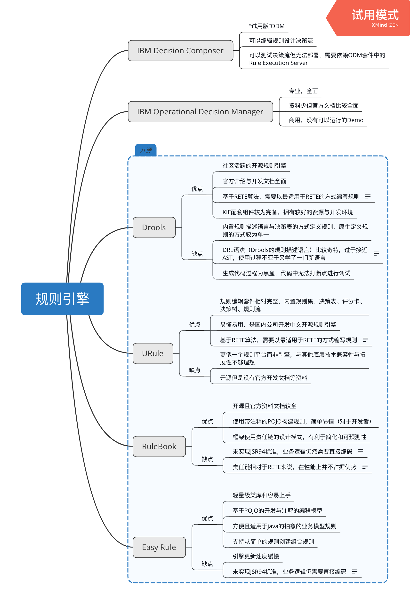

## 规则引擎对比

目前社区中的开源规则引擎：

| 规则引擎  | 开源协议 | 最后Releases版本日期 | 发布频率 |
| :-------: | :------: | :------------------: | :------: |
|  Drools   | ASL 2.0  |     2019年3月7日     | 1-2个月  |
|   URule   | ASL 2.0  |    2018年11月21日    | 1-7个月  |
| Easy Rule |   MIT    |    2018年4月10日     | 5-12个月 |
| RuleBook  | ASL 2.0  |    2018年12月5日     | 4-8个月  |

原生规则引擎的规则定义方式（工具）：

| 规则引擎  | 简单规则 | 决策表 | 决策树 | 规则流 | 评分卡 |
| :-------: | :------: | :----: | :----: | :----: | :----: |
|  Drools   |    ✅     |   ✅    |   ❌    |   ❌    |   ❌    |
|   URule   |    ✅     |   ✅    |   ✅    |   ✅    |   ✅    |
| Easy Rule |    ✅     |   ❌    |   ❌    |   ❌    |   ❌    |
| RuleBook  |    ✅     |   ❌    |   ❌    |   ❌    |   ❌    |

**后四项属于简单规则的延伸功能，主要方便以图形化、多样化的的形式进行规则编辑。**

下图列举了以下几种规则引擎的特点与优缺点：

Drools：参照了JSR94标准，使用了JAVA标准API，但是标准并未规范**规则描述语言**，所以Drools拥有自己私有的描述语言（DRL），同时使用[Rete算法](https://en.wikipedia.org/wiki/Rete_algorithm)的增强实现，这就有一个问题，只有规则按照Rete算法的逻辑去编写引擎才能发挥更好的效能，否则则会降低效能。

URule：虽然URule自带的"工具"比较齐全相对来说是比较完整的，但是很多功能是属于拓展性功能，其次就是系统的拓展性仍然是一个很大的问题——官方给出的开发文档不齐全，只有对该引擎（平台）的介绍与使用文档。

RuleBook：未参照JSR94标准，规则定义在代码中，未使用Rete算法，但是使用了责任链的设计模式，增强了规则可读性，但是相比于Rete性能较差。

EasyRule：未参照JSR94标准，规则定义在代码中，轻量级类库，方便理解容易上手，开发成本低，未使用Rete算法，发布周期较长且社区文档、社区活跃度不够健全，维护成本高。

