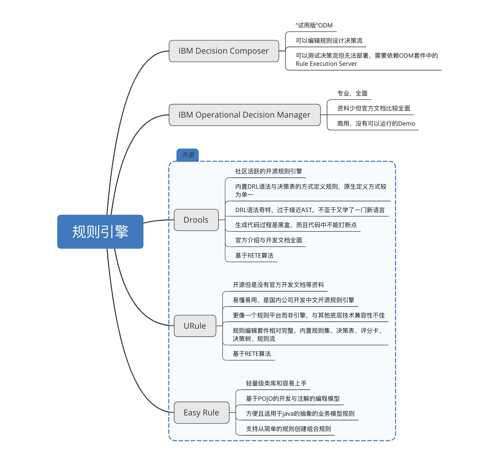

## 规则引擎对比

目前社区中的开源规则引擎：

| 规则引擎  | 开源协议 | 最后Releases版本日期 | 发布频率 |
| :-------: | :------: | :------------------: | :------: |
|  Drools   | ASL 2.0  |     2019年3月7日     | 1-2个月  |
|   URule   | ASL 2.0  |    2018年11月21日    | 1-7个月  |
| Easy Rule |   MIT    |    2018年4月10日     | 5-12个月 |

原生规则引擎的规则定义方式（工具）：

| 规则引擎  | 简单规则 | 决策表 | 决策树 | 规则流 | 评分卡 |
| :-------: | :------: | :----: | :----: | :----: | :----: |
|  Drools   |    ✅     |   ✅    |   ❌    |   ❌    |   ❌    |
|   URule   |    ✅     |   ✅    |   ✅    |   ✅    |   ✅    |
| Easy Rule |    ✅     |   ❌    |   ❌    |   ❌    |   ❌    |

下图列举了以下几种规则引擎的特点与优缺点：

